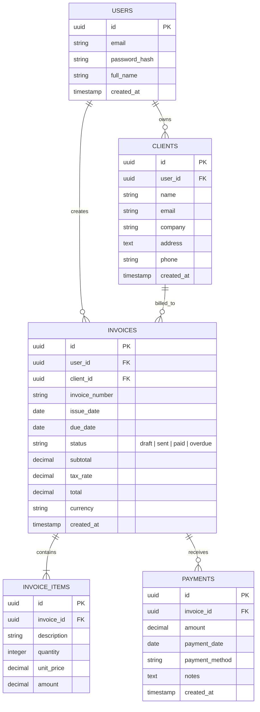

# Receively MVP — System Architecture

## 1. System Overview

**Receively MVP** is structured as a **Decoupled Client–Server Monolith** inside a single Git repository. The frontend client and backend API server maintain a strict separation of concerns, communicating exclusively over HTTP via standard REST endpoints and JSON payloads.

```
┌──────────────────────────────────────────────────────────────┐
│                      Client Application                      │
│                    (React / Vite on :5173)                   │
│                                                              │
│  - Presentation UI (Tailwind CSS, component hierarchy)       │
│  - Client State & Navigation                                 │
│  - Centralized API Client (Axios / Fetch)                    │
└──────────────────────────────┬───────────────────────────────┘
                               │
                               │ HTTP / REST / JSON (CORS-guarded)
                               ▼
┌──────────────────────────────────────────────────────────────┐
│                      Backend API Server                      │
│                 (Node.js / Express on :4000)                 │
│                                                              │
│  - CORS & Security Headers (Helmet, Rate Limiting)           │
│  - Auth Middleware (JWT token validation, User extraction)   │
│  - Request Validation (Zod schemas)                          │
│  - Controllers & Business Services                           │
│  - Parameterized Database Models                             │
└──────────────────────────────┬───────────────────────────────┘
                               │
                               │ SQL / Connection Pool
                               ▼
┌──────────────────────────────────────────────────────────────┐
│                      Persistence Layer                       │
│                     (PostgreSQL Database)                    │
└──────────────────────────────────────────────────────────────┘
```

---

## 2. Component Boundaries & Responsibilities

### Frontend (`client/`)
- **Technology:** React (Vite-powered), Tailwind CSS.
- **Responsibilities:**
  - Rendering dashboards, client lists, invoice creators, and payment histories.
  - Handling client-side routing and protected routes based on session state.
  - Form validation and dynamic row additions (line items on invoices).
  - Calling backend endpoints via a single centralized API client module (`services/api.js`).
  - Never accesses the database or references backend server secrets.

### Backend (`server/`)
- **Technology:** Node.js, Express.js.
- **Responsibilities:**
  - Serving REST API routes prefixed with `/api` (e.g. `/api/auth`, `/api/clients`, `/api/invoices`).
  - Enforcing authentication tokens and decoding `user_id`.
  - Validating incoming payloads with Zod schemas before executing business logic.
  - Calculating invoice subtotals, tax rates, total balance, and payment reconciliation.
  - Executing parameterized PostgreSQL queries strictly scoped to the requesting user (`WHERE user_id = $1`).

---

## 3. Core Domain Entities



---

## 4. Communication & Security Architecture

1. **CORS Protocol:** The backend allows cross-origin requests exclusively from the designated client origin (e.g., `http://localhost:5173` or production frontend domain).
2. **Authentication Flow:**
   - User submits credentials to `POST /api/auth/login`.
   - Server validates credentials, generates a signed JWT containing `{ userId }`.
   - Tokens are passed via `Authorization: Bearer <token>` headers or secure `HttpOnly` cookies.
   - Protected routes extract `req.user.id` to enforce multi-tenancy.
3. **Data Isolation (Tenant Boundary):** Every single database query affecting clients, invoices, items, or payments must enforce `WHERE user_id = $userId`.
